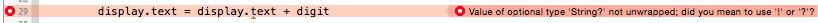
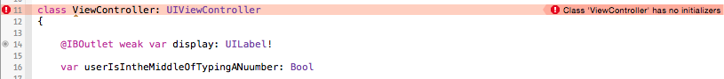

#Swift journey

The goal of this document is to reference any commentary, tip or generally anything learned on the Swift Programming language. Most of this will probably be related to the Paul Hegarty's course : Developping apps for iOs 8 (cf Standford University, iTunes U ©).  

##Day one : Calculator (id:1stDay)


* First problem : optional Strings
        
`        
let digit = sender.currentTitle!
`


	digit is actually an optional that can be a string.
	The actual type of it is : String? 
	The ? standing for optional
	The ! next to currentTitle is here to "unwrap" the optional and get the string out of it
            
    ⚠️ Use the ! carefully : if the value of the variable next to it is 'not set' or nil, it will crash the program.
        
        
```       
let digit = sender.currentTitle!
        ```
        
        
 Similar problem below  : there's an **error** 
 



  
  
	Why is that ? Because week-end want to add two variables that doesn't have 
	the same type. Because digit is a String, I think Swift want to convert it 
	to String.
	But still, it's not unwrapped. It's an optional String 
	-> adding a ! next to it will fix it.


* Second problem : initializers



Now it says Class 'ViewController' has no initializers. That's because week-end declared userIsIntheMiddleOfTypingANumber without giving it a value nor giving it an initializer. 

In Swift, all properties have to be initialized when the object is initialized. They have to have a value. The value can be nil if they're optional.

	To correct that, you have two alternatives to give it a value : 
	1.With an initializer (we'll see that later)

	2.Directly give it a value with affectation
`var userIsIntheMiddleOfTypingANumber: Bool = false`