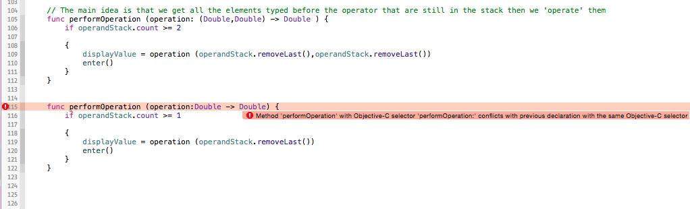

#Swift journey

The goal of this document is to reference any commentary, tip or generally anything learned on the Swift Programming language. Most of this will probably be related to  Paul Hegarty's course : Developping apps for iOs 8 (cf Standford University, iTunes U ©).  


##[Day one : Calculator](id:1stDay)
===


### First problem : optional Strings
===     
`let digit = sender.currentTitle!`


	digit is actually an optional that can be a string.
	The actual type of it is : String? 
	The ? standing for optional
	The ! next to currentTitle is here to "unwrap" the optional and get the string out of it
            
    ⚠️ Use the ! carefully : if the value of the variable next to it is 'not set' or nil, it will crash the program.
        
        
`let digit = sender.currentTitle!`
        
        
 Similar problem below  : there's an **error** 
 


  
  
	Why is that ? Because week-end want to add two variables that doesn't have 
	the same type. Because digit is a String, I think Swift want to convert it 
	to String.
	But still, it's not unwrapped. It's an optional String 
	-> adding a ! next to it will fix it.


### Second problem : initializers
===


Now it says Class 'ViewController' has no initializers. That's because week-end declared userIsIntheMiddleOfTypingANumber without giving it a value nor giving it an initializer. 

In Swift, all properties have to be initialized when the object is initialized. They have to have a value. The value can be nil if they're optional.

	To correct that, you have two alternatives to give it a value : 
	1.With an initializer (we'll see that later)

	2.Directly give it a value with affectation
`var userIsIntheMiddleOfTypingANumber: Bool = false`


### Third problem :  implicitly unwrapped optionals
===
Above we said that in Swift, all properties needed to be initialized.
So why doesn't the compiler complains as the display property is not set ?
Well, that's straightforward : **it IS set**.  But how ? Because of the ! in the declaration that :

* initialize it to nil 
* unwrap it automatically when it's called.

This kind of type applies well to properties that get set very early in the execution of the program and then stay set forever.
Still, if its value remains nil, the program will crash. Though it's not supposed to happen.


### Fourth thing : Type inference / Array creation
===
    
`var operandStack: Array <Double> = Array <Double> ()`

and 

`var operandStack = Array <Double> ()`

 are actually equivalent because of Swift type inference. The second option is recommended though.

 

### Fifth problem : Objective-C and overloading
===




Objective-C does not support method overloading, but Swift does. That's why we can't overload our function to do 2-operands operations and single-operand operations with the same name. But wait, aren't we coding in Swift ? 

Yes, but ... not exactly.

As we inherited our ViewController from UIViewController, we inherited NSObject and made the class interopable to Obj-C.That's why it works when you remove the inheritance.
 

### Sixth problem : return of a dictionnary
===

In Swift a dictionnary return an Optional value. Why is that ? Because, if the value can't be found in the dictionnary, it must be able to return nil.

That why this is incorrect : 

```
var dico = [String:Int]()

dico["neuf"] = 9

let number  = dico["neuf"] 

if number < 10 {  // we cannot compare optional int and int

/**
* Operations with numbers here
*/

}

```
And this is correct (because of optional binding) : 

```

var dico = [String:Int]()

dico["neuf"] = 9

if let number  = dico["neuf"] {

/**
* Operations with numbers here
*/

}


```

### Seventh problem : Public and privates
===
In Swift, in a class, if you don't put any access keyword in front of a property or method, it'll be public ... 

If you put the keyword private, it won't be accessible in the outside of the class.

But if you use the keyword public, it'll be accessible to anyone to do anything. 
⚠️Use the public keyword with caution.

### Eight problem : Printable values
===

If I define an enum, or a struct and try to printl them, it might return me things like Enum value or other things not explicit to the reader understanding.
In order to correct that, you've got to tell them how to prnt themselves. But how do I do that ?
By implementing the Printable protocol.
See below : 

```
 enum Op : Printable 

```


This is a protocol that need only one thing : a property **read-only ** called description that you need to compute. (Because there's only computed properties allowed in enums).
See below : 

```

        var description : String {
            get{
                switch self {
                case .Operand(let operand) : return "\(operand)"
                case .UnaryOperation(let symbol, _): return symbol
                case .BinaryOperation(let symbol, _): return symbol
                    
                }
            }
            
        }
```


